# AWS Static Site — Production-Grade Deployment Pipeline

> Host a **secure, highly available and scalable static website** on AWS — fronted by CloudFront, protected by AWS WAF, served over HTTPS with an ACM certificate, and continuously deployed from GitHub using **OIDC (keyless) GitHub Actions**.


-success)


---

## 📐 Architecture

A user requests the site → **Route 53** resolves the domain → the request hits **CloudFront** (CDN, global edge caching, HTTPS) → **AWS WAF** filters malicious traffic → CloudFront pulls content from the **S3 origin** via a locked-down **Origin Access Control (OAC)**. Access logs land in a dedicated **logs bucket**, and **CloudWatch** powers dashboards + alarms.

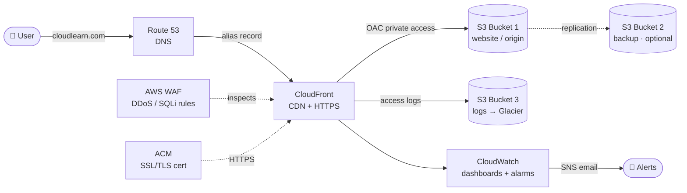

---

## 🧰 AWS Services Used

| Service | Purpose |
| --- | --- |
| **Amazon S3** | Stores the website pages **privately** (origin). Versioning + encryption enabled. |
| **Amazon CloudFront** | Global CDN, edge caching, HTTP→HTTPS redirect, OAC to the private bucket. |
| **AWS Certificate Manager (ACM)** | Free SSL/TLS certificate so the site is served over **HTTPS**. |
| **Amazon Route 53** | DNS + hosted zone; alias record points the domain at CloudFront. |
| **AWS WAF** | Web security — blocks DDoS, SQL injection and common L7 attacks. |
| **Amazon CloudWatch** | Monitoring & observability — dashboards, 4xx/5xx metrics, alarms via SNS. |
| **GitHub Actions + OIDC** | Keyless CI/CD that syncs the site to S3 and invalidates CloudFront. |

---

## 🚀 CI/CD Pipeline (GitHub Actions)

Every push to `main` triggers an automated, **keyless** deploy via AWS OIDC — no long-lived access keys are stored in GitHub. See [`.github/workflows/deploy.yaml`](.github/workflows/deploy.yaml).

### Pipeline stages

```
push → main
   │
   ├─ 1. Checkout code
   ├─ 2. Configure AWS credentials  (OIDC → assume IAM role)
   ├─ 3. Sync assets to S3          (long cache: max-age=1y, immutable)
   ├─ 4. Sync HTML to S3            (no-cache so visitors get the latest)
   ├─ 5. Invalidate CloudFront      (waits for completion)
   └─ 6. Deployment summary         (bucket / region / commit)
```

### Production-grade features

- **OIDC authentication** — GitHub assumes an IAM role; **zero static AWS keys**.
- **`concurrency`** — only one production deploy at a time; newer pushes cancel older runs.
- **Two-pass cache strategy** — static assets cached for a year (`immutable`), HTML served `no-cache` so updates are instant.
- **CloudFront invalidation with `wait`** — the run only goes green once the cache is actually cleared.
- **`workflow_dispatch`** — manual re-deploy button in the Actions tab.
- **`timeout-minutes`** guard and a Markdown **deploy summary** on every run.

### Required GitHub Secrets

`Settings → Secrets and variables → Actions`

| Secret | Description | Example |
| --- | --- | --- |
| `AWS_IAM_ROLE` | ARN of the OIDC deploy role | `arn:aws:iam::123456789012:role/github-actions-deploy-role` |
| `AWS_REGION` | Region of your bucket | `ap-south-1` |
| `S3_BUCKET` | Website (origin) bucket name | `cloudforge-devops-website` |
| `CLOUDFRONT_DIST_ID` | CloudFront distribution ID | `E1AB2CD3EF4GHI` |

### One-time OIDC trust setup (AWS)

1. **IAM → Identity providers → Add provider → OpenID Connect**
   - Provider URL: `https://token.actions.githubusercontent.com`
   - Audience: `sts.amazonaws.com`
2. **IAM → Roles → Create role → Web identity**
   - Identity provider: `token.actions.githubusercontent.com`
   - Audience: `sts.amazonaws.com`
   - GitHub org / repo / branch: lock to **this repo** and **`main`**.
3. Attach a least-privilege policy (see below) and copy the **Role ARN** into the `AWS_IAM_ROLE` secret.

<details>
<summary><b>Least-privilege IAM policy for the deploy role</b></summary>

```json
{
  "Version": "2012-10-17",
  "Statement": [
    {
      "Sid": "S3SyncWebsite",
      "Effect": "Allow",
      "Action": ["s3:ListBucket", "s3:GetObject", "s3:PutObject", "s3:DeleteObject"],
      "Resource": [
        "arn:aws:s3:::cloudforge-devops-website",
        "arn:aws:s3:::cloudforge-devops-website/*"
      ]
    },
    {
      "Sid": "CloudFrontInvalidate",
      "Effect": "Allow",
      "Action": ["cloudfront:CreateInvalidation", "cloudfront:GetInvalidation"],
      "Resource": "arn:aws:cloudfront::ACCOUNT_ID:distribution/DISTRIBUTION_ID"
    }
  ]
}
```
</details>

---

## 🛠️ Manual Deployment (step-by-step)

### Step 1 — Register / configure the domain (Route 53)
Register a domain in **Route 53 → Registered domains**, or use an external registrar (GoDaddy, Namecheap, etc.) and point its **NS records** to a Route 53 **public hosted zone**.

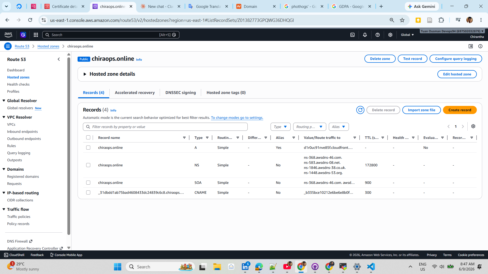

### Step 2 — Create the S3 buckets
Create the buckets with **ACL disabled**, **Block all public access ON**, **Versioning enabled** and **server-side encryption enabled**:

| Bucket | Purpose |
| --- | --- |
| `…-website` | Bucket 1 — website origin (private). |
| `…-logs` | Bucket 3 — CloudFront/S3 access logs. |
| `…-backup` *(optional)* | Bucket 2 — replication backup of bucket 1. |

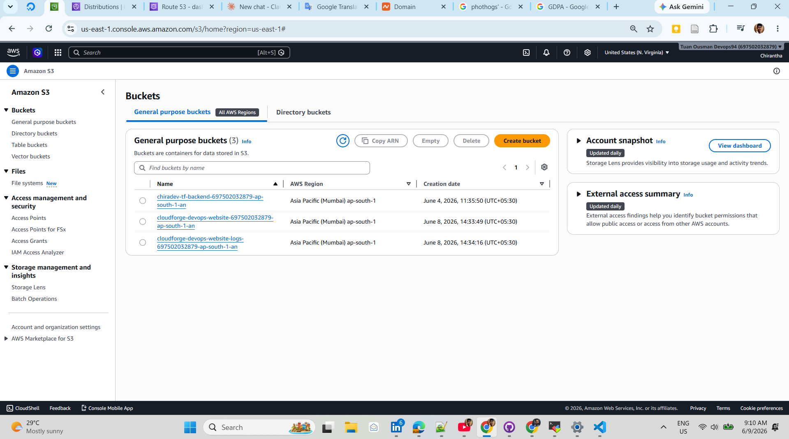

> **Cost optimization:** on the **logs** bucket add a **lifecycle rule** → *Move all objects to Glacier Deep Archive after 30 days* (logs older than 30 days are rarely read, so this cuts storage cost).

### Step 3 — Upload the website
Upload `index.html` to the **website** bucket. Objects stay **private** — only CloudFront can read them (via OAC).

### Step 4 — Request an SSL certificate (ACM)
In **ACM** request a public certificate for `yourdomain.com` (and `*.yourdomain.com` wildcard). Validate ownership with the **CNAME record** added to Route 53.

> ⚠️ For a CloudFront distribution, the ACM certificate **must be created in `us-east-1` (N. Virginia)**.

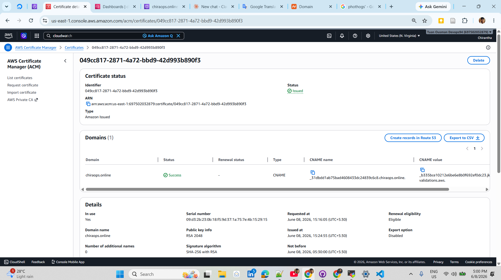

### Step 5 & 6 — Create the CloudFront distribution + OAC
Create a CloudFront distribution with:
- **Origin** = the website S3 bucket
- **Origin access** = *Origin access control (OAC)* → CloudFront auto-creates the **bucket policy** so **only CloudFront** can read the bucket
- **Viewer protocol policy** = *Redirect HTTP → HTTPS*
- **Alternate domain names (CNAMEs)** = your domain + the ACM certificate
- **Default root object** = `index.html`

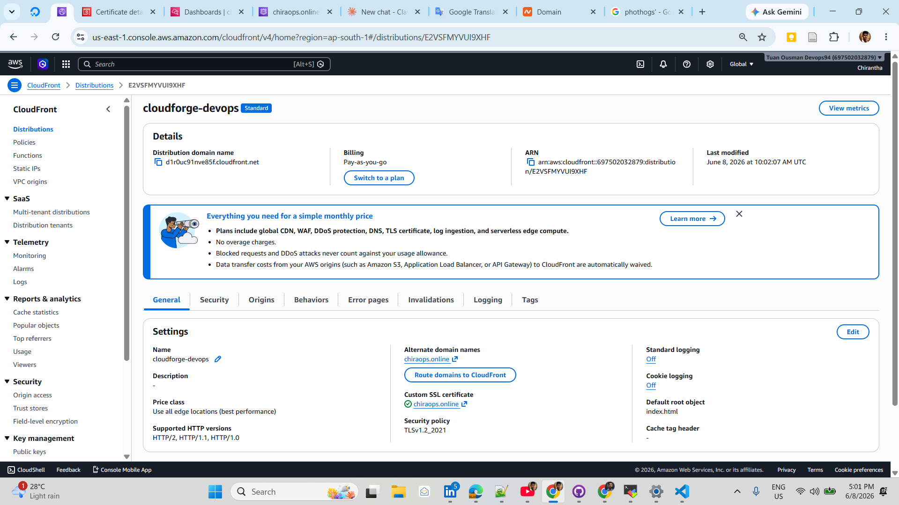

### Step 7 — Create the Route 53 alias record
In the hosted zone create an **A record (Alias)** pointing the apex domain to the **CloudFront distribution**. Once the status is **INSYNC**, the site is live over HTTPS.

### Step 8 — Enable WAF
Attach **AWS WAF** to the distribution with managed rule groups (DDoS / SQLi / common attacks). Use **monitor (count) mode** while learning, then switch to **block** in production.

| | | |
| --- | --- | --- |
| 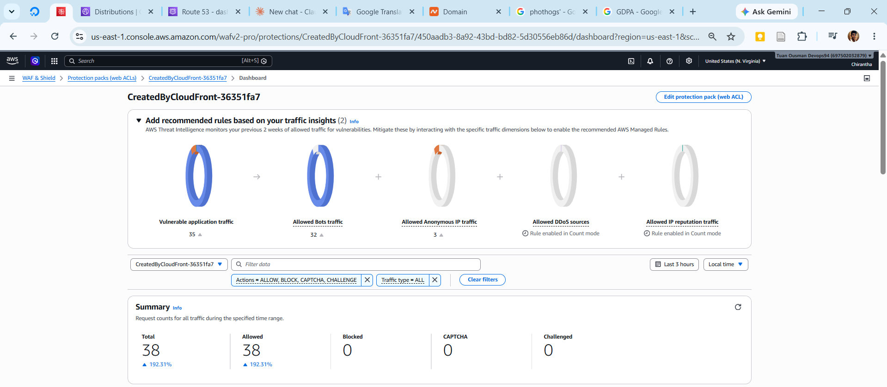 | 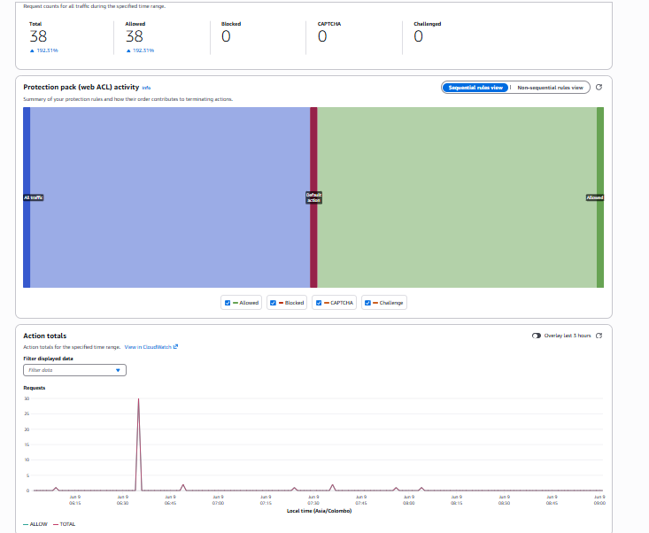 | 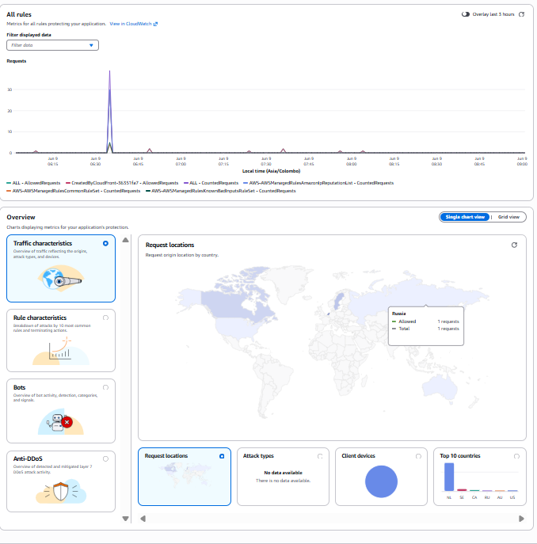 |

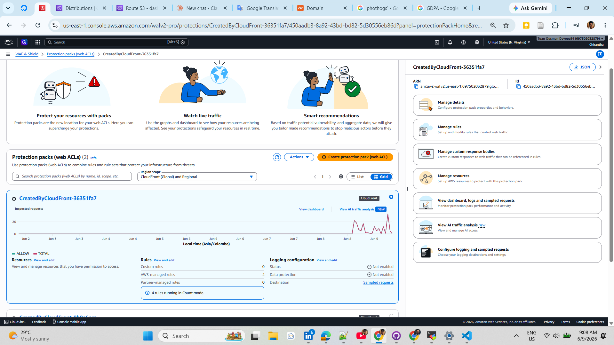

### Step 9 — Enable access logging
On the CloudFront distribution → **Logging → Create access log delivery → Amazon S3** → destination = the **logs** bucket.

---

## 📊 Monitoring & Alerting (CloudWatch)

Build a **CloudWatch dashboard** on the *CloudFront → per-distribution metrics* (requests, bytes downloaded, 4xx/5xx error rates). CloudFront is global, so its metrics live in the **N. Virginia (`us-east-1`)** region.

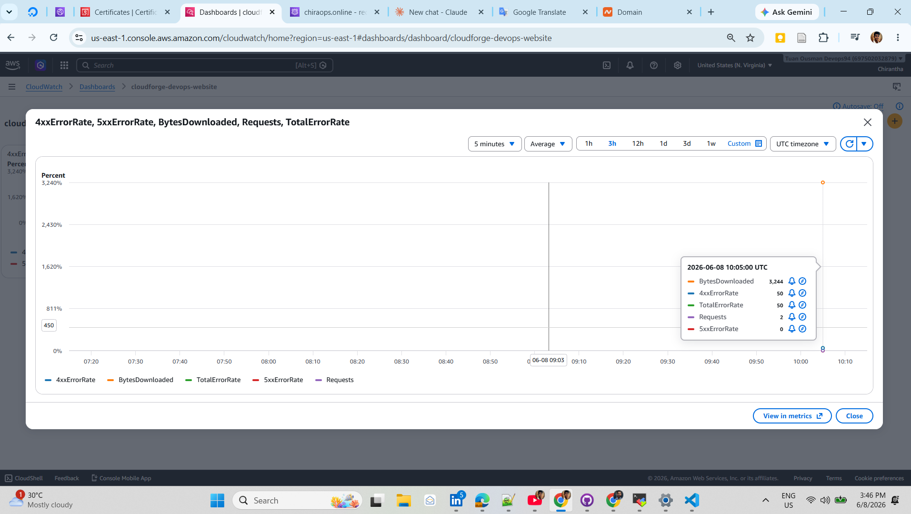

Create an **alarm** that emails you (via **SNS**) when errors spike — e.g. *more than 10 `5xx` errors in a single minute*:

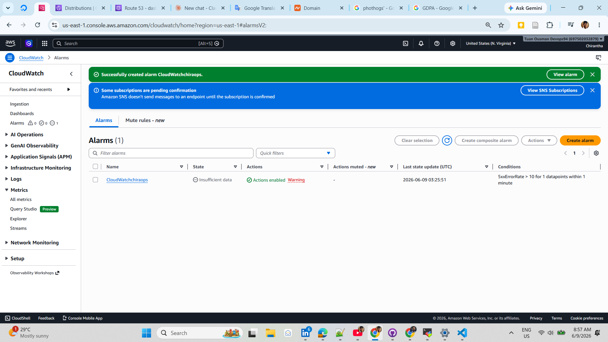

> Confirm the **SNS subscription email** before alerts start arriving.

---

## 🔒 Security & Best Practices Applied

- ✅ S3 buckets fully **private** (Block Public Access + ACLs disabled) — content only reachable through CloudFront OAC.
- ✅ **HTTPS-only** via ACM + CloudFront HTTP→HTTPS redirect.
- ✅ **AWS WAF** in front of CloudFront for L7 protection.
- ✅ **Versioning** on all buckets — accidental edits/deletes are recoverable.
- ✅ **Lifecycle rules** move old logs to **Glacier Deep Archive** (cost control).
- ✅ **Server-side encryption** at rest on every bucket.
- ✅ **Keyless CI/CD** with OIDC — no static AWS credentials in GitHub.
- ✅ **Access logging** to a dedicated logs bucket + CloudWatch observability.

---

## 📁 Project Structure

```
aws-static-site-production-pipeline/
├── .github/
│   └── workflows/
│       └── deploy.yaml        # OIDC CI/CD pipeline → S3 + CloudFront
├── docs/                      # Architecture & console screenshots
│   ├── HostedZone.png
│   ├── S3.png
│   ├── ACM.png
│   ├── CLoudFront.png
│   ├── WAF1.png · WAF2.png · WAF3.png · WAFDAshboard.png
│   ├── awscloudwatch_dashboard.png
│   └── CloudwatchAlerm.png
├── index.html                 # The static website
└── README.md
```

---

## 👤 Author

**chiradev** · `v1.0.0`

Built as a production-ready reference for hosting secure, scalable static websites (HTML / React / Angular / docs sites) on AWS with automated GitHub Actions delivery.
